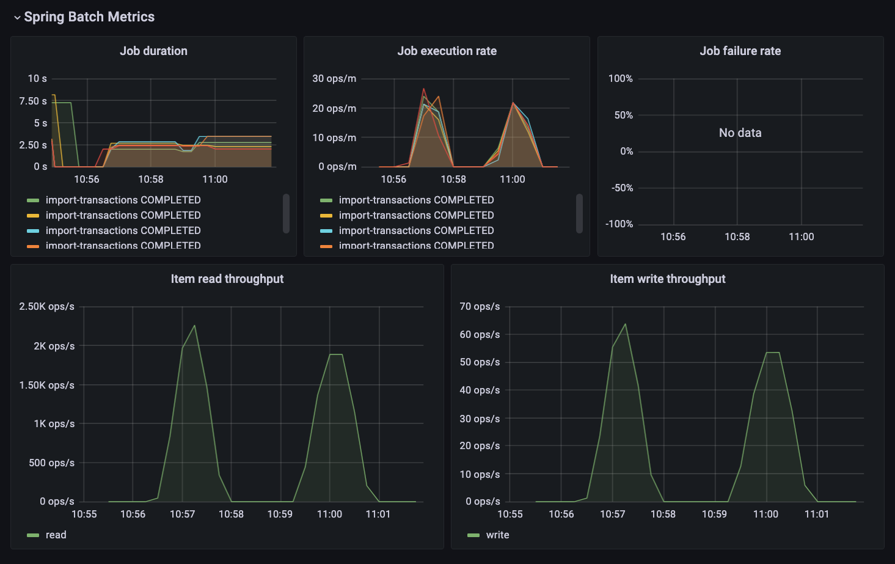

# Batch Playground

This repository is used as a playground to experiment building and testing Spring Batch and Spring Cloud Task applications.

# Tests

Most of the tests in `app` are end-to-end (journey tests) and require the `external-system` to be up and running.

Note: the external-system application will run with `chaos-monkey` enabled by default to simulate transient failures at runtime.
This is done in order to harness the robustness of the batch application.

Other tests in the application will also require additional processes for the database, queue and workers.

In order to run all the necessary components we can leverage the `docker-compose.yaml` file and run this command in the root of the project:

```
docker compose up
```

And then in another terminal:

```
./mvnw -pl app test -P e2e
```

## Metrics

Metrics are collected by `Prometheus` every 5s and `Grafana` has been already configured with some custom dashboards
that can be used to monitor the performance of the batch operations:

- JVM (Micrometer)[^1]: used to display general and common metrics for JVMs
- Spring Batch Prometheus[^2]: used to display throughput and some common metrics for batch processing




[^1]: This is a modified dashboard, the original one comes from the open source Dashboard in the Grafana website and can be found [here](https://grafana.com/grafana/dashboards/4701-jvm-micrometer/)
[^2]: This is a modified dashboard, the original one comes from the open source GitHub repository of Spring Batch and can be found [here](https://github.com/spring-projects/spring-batch/blob/main/spring-batch-samples/src/grafana/spring-batch-dashboard.json)
